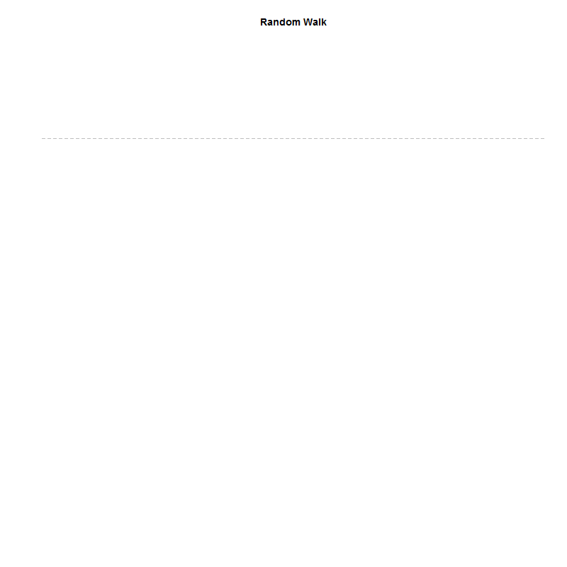

##static random walk
```{r}
random.walk <- cumsum(rnorm(100))
  
plot( random.walk, type="l", col="darkred", axes=F, xlab="", ylab="", main="Random Walk" )
abline( h=0, lty=2, col="gray" )
```


```{r}
y <- cumsum( rnorm(100) )

max.y <- max(y)
min.y <- min(y)

library( animation )
library (magick)
random.walk <- cumsum(rnorm(100))
saveGIF({

for( i in 1:100 ){
  
  plot( random.walk[1:i], type="l", col="darkred", axes=F, xlab="", ylab="", main="Random Walk", xlim=range(1:100), ylim=c(min.y,max.y))
abline( h=0, lty=2, col="gray" )
}
},

movie.name = "random_walk.gif",  
interval = 0.3,        
ani.width = 800,         
ani.height = 800 )
            
```


